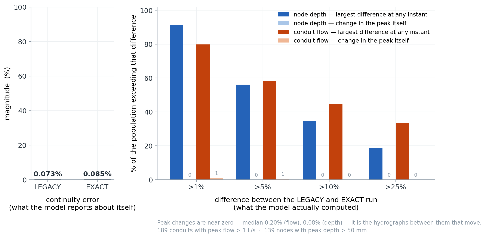
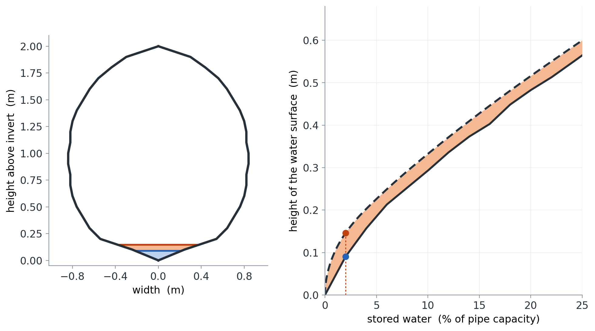

# Exact and user-defined cross-section geometry for SWMM

### What built-in shape tables get wrong, what replaces them, and what it costs

*Open-Source SWMM Engine*
*Author: Corinne Wiesner-Friedman*

---

## Where this started

I am building an uncertainty sidecar slowly for SWMM on a different branch
(I am super excited to post about that down the road). It has me constantly
wondering about uncertainty that exists in SWMM that I may overlook. I started
to think about SWMM's look up tables, which are approximations of pipe shapes.
I was thinking, well, how much error might this account for and under what
conditions? What might this mean for pipe Manning's? When we calibrate this,
are we just calibrating something that may very well just be an error term? In
particular, how might this affect the finite volume solve?

I started investigating this and after realizing that pipe geometry has bigger
implications to a finite volume solver, I ended up pursuing work from the
practical perspective of finding an approach that would reduce that error and
let people input any hollow pipe shape they want.

I have really enjoyed reviewing some math I kind of knew and deepening my
understanding of it in application to this work.

What follows is an AI-written summary that I directed and verified about what
turned up and some of what it implies.

Maybe this will spark your interest if you have a network with some funky
shapes. I hope you try out these new features, help debug a bit, and get back
to me on how your results may have changed.

*— Corinne Wiesner-Friedman*

---

> Five-minute version. SWMM describes each built-in pipe shape with two
> small lookup tables that contradict each other: differentiate the area
> description and you do not get the width table back. That is not a precision
> problem. The equations these solvers integrate assume top width *is* the
> derivative of area, so an inconsistent pair means the solver is being handed
> a cross-section that cannot exist.
> We replaced the tables with exact geometry, which fixes that by construction.
>
> The finding worth your attention is what happened next: switching to exact
> geometry moved dynamic-wave hydrographs — a median of 7% of peak flow at each
> conduit's worst moment, 1.2% averaged over the whole record — while the
> continuity error stayed flat at ~0.08%. The model's standard quality check
> is structurally blind to this class of error. Peak values themselves barely
> moved, which is a finding in its own right. Everything below expands on that,
> and every claim links to the code or the measurement behind it.

---

## Continuity stayed flat while the predictions moved

Both panels are the same two runs: Bellinge (1015 conduits, 48 h,
dry-weather), dynamic wave, one binary, one changed option —
`XSECT_GEOMETRY LEGACY` versus `EXACT`.

*Left:* what the model says about its own quality. Continuity error moves from
0.073% to 0.085%. By that measure, nothing happened.

*Right:* what the model actually computed. Take each of the 189 conduits
carrying more than 1 L/s and ask how far apart the two flow records ever get,
as a fraction of that conduit's own peak: 80% diverge by more than 1% of
peak at some point, 45% by more than 10%, and 33% by more than 25%. Median
7.0%; averaged over the whole 48 h rather than taken at the worst instant, the
median is still 1.2% and the upper decile 14%. Node depths behave the same way
(median 5.8% at the worst instant; one node's depth differs by 755 mm at one
moment).

What does *not* move is the peak. Peak flows agree to a median of 0.20%,
and the largest change in any node's peak depth across the whole network is
2 mm. So exact geometry does not rescale the answer — it shifts the timing and
shape of the hydrograph underneath an almost unchanged peak. That distinction
matters if you calibrate to peaks, and it matters more if you use the model for
anything that integrates over the record: first flush, pump cycling, CSO spill
duration, sediment transport.

Same water, same network, same solver, same time-step settings. The only
difference is how the pipe's cross-section was described.

> The uncomfortable implication. A modeler checking continuity to decide
> whether a run is trustworthy would see no reason for concern in either run.
> The error is real, it is systematic, and the standard diagnostic cannot see
> it. That is what "unquantified uncertainty" looks like in practice — not a
> missing error bar, but a quality check pointed at the wrong quantity.

---

## The area and width tables describe different pipes

SWMM describes each shape's area and its top width with separate,
independently digitized tables — and for four shapes the area description is
itself a second table, inverted. But width is the derivative of area; they are
not independent facts. Differentiate the area description and you should
recover the width table. You do not.

A 2 m gothic sewer holding 2% of its capacity. Gothic is one of the shapes
that ships no area table, so its area comes from a 51-point *depth-of-area*
table instead: read that, and the water surface is at 0.090 m. Integrate
the shape's own 21-point width table to the same stored volume and it is at
0.146 m. The orange band is the 56 mm the two descriptions cannot agree
about — drawn at true scale. At 0.5% capacity the two answers are 23 mm and
74 mm — more than a factor of 3.

A LEGACY run consults both tables in the same timestep — area from one,
width from the other — so the disagreement propagates into surface storage,
friction and wave speed continuously.

The disagreement is worst where models spend dry weather, and it is much
worse for some shapes than others:

| Shape | width pts | at 2% depth | median, full range | >10% off across |
|---|---|---|---|---|
| CIRCULAR | 51 | −34% / +22% | 0.7% | 5% of depth |
| HORSESHOE | 26 | +28% | 1.3% | 11% |
| BASKETHANDLE | 26 | +47% | 5.6% | 19% |
| EGGSHAPED | 26 | +37% | 8.1% | 42% |
| SEMIELLIPTICAL | 21 | +82% | 10.7% | 53% |
| CATENARY | 21 | +97% | 15.0% | 60% |
| GOTHIC | 21 | +202% | 14.4% | 65% |
| SEMICIRCULAR | 21 | +72% | 17.7% | 71% |

Two notes on reading that table. The `2% depth` column is a local slope, so it
is sensitive to where the table's own nodes fall: `y/D = 0.02` is *exactly* a
node of circular's 51-point table, and the slope jumps from −34% just below it
to +22% just above, which is why that cell carries two numbers. Every other row
sits mid-interval and is a single value. The last two columns are dense sweeps
and are not node-sensitive.

The pattern is not random: of the eight shapes here, the four worst are
exactly the four that ship no area table at all. Those four carry only a
21-point width table plus 51-point depth-of-area and section-factor tables, and
their area is recovered by inverting the depth-of-area table
([`XSectKernels.hpp`](../../src/engine/hydraulics/XSectKernels.hpp)) — a second,
independently digitized description of the same pipe, which is exactly why it
need not agree with the first. Circular — the best-resourced shape, and the one
most networks are mostly made of — is by far the best behaved. (The pattern is
suggestive rather than a law: `HORIZ_ELLIPSE`, which is not in the table above
and *does* ship a 26-point area table, computes to a comparable ~12% median.)

> Why this is a correctness problem, not just a precision one. The
> Saint-Venant equations are not agnostic about geometry — they are *derived*
> assuming a real cross-section. Continuity is $\partial A/\partial t +
> \partial Q/\partial x = q$, and writing it in the depth form every solver
> actually uses requires the chain rule step $\partial A/\partial t =
> T\,\partial y/\partial t$ — which is valid only if $T = dA/dy$. Give the
> solver a $T$ that is not the derivative of its $A$ and the discrete system
> is no longer a discretization of the shallow-water equations for any pipe.
> It is a discretization of an inconsistent system.
>
> This is not abstract. Dynamic wave uses top width to convert net inflow
> into head change at a node (`surfArea = (w1 + wM)·length/4`,
> [`DynamicWave.cpp`](../../src/engine/hydraulics/DynamicWave.cpp)) and
> area to report the volume stored in the conduit
> (`links.volume = area_mid · length · barrels`). Those are precisely the two
> tables that disagree. No physical cross-section has gothic's tabulated area
> *and* its tabulated width — so the pipe the momentum equation sees and the
> pipe the continuity equation sees are different objects.
>
> Exact geometry does not merely reduce this error, it removes its cause. Area
> and width stop being two digitizations and become two boundary integrals of
> one and the same outline, on which $T = dA/dy$ holds identically. What the
> solver evaluates is a compiled approximation of that outline, so the identity
> survives to the fit tolerance rather than to the last bit: measured on a
> compiled 4 ft circle, $|dA/dy - T|/T$ has a median of $1\times10^{-8}$ and a
> worst case of $1.5\times10^{-7}$. The circular tables it replaces, measured
> the same way over the same depth window, sit at 0.6% median and 22% worst —
> six orders of magnitude apart, and circular is the *best* of the shapes.

> Dig deeper. The constants themselves:
> [`xsect_tables.hpp`](../../src/engine/hydraulics/xsect_tables.hpp). The
> inherited-defect register, including this one as LD-1:
> [`docs/dev/legacy_defects.md`](../dev/legacy_defects.md). Reproduce the
> table above by resampling both descriptions — the area table where one
> exists, the inverted depth-of-area table where it does not — scaling by each
> shape's `aFull`/`wMax` from
> [`xsect.c`](../../src/legacy/engine/xsect.c), differentiating the area, and
> comparing to the width table.

---

## Only finite volume converts a geometry error into a mass error

The same geometry error sits in both solvers. Only one of them has an
instrument that detects it.

- Dynamic wave *consults* geometry. It asks for an area at a depth and
  uses the answer. The error perturbs that timestep and leaves no trace in any
  mass balance.
- Finite volume *embeds* geometry in its conservation statement. Cell state
  is flow area; depth is recovered by inverting the same geometry every
  substep. A geometry inconsistency becomes a mass error — and mass errors
  show up on the continuity line.

| | LEGACY | EXACT | |
|---|---|---|---|
| FV, 2 h window | −2.253% | −0.134% | ~17× better |
| FV, filling window | −4.453% | −0.022% | ~200× better |
| DYNWAVE | −0.073% | +0.085% | no meaningful change |

Read this the right way round. FV's large continuity error under LEGACY is not
evidence that FV is worse — it is evidence that FV can see something DYNWAVE
cannot. The dynamic-wave row looks clean not because its geometry is
accurate, but because it has no mechanism that converts geometry error into
mass error. The figure at the top of this piece is what that same error looks
like when you go and measure it directly instead of trusting the diagnostic.

The reason is worth stating plainly, because it is structural rather than
incidental: DYNWAVE's continuity check balances volumes that are themselves
computed from the geometry in question. Stored conduit volume is
`area × length`, read from the same area table that drives the routing. A
geometry error therefore shifts both sides of the ledger together and the
balance still closes. The check confirms the bookkeeping is self-consistent;
it was never an instrument for asking whether the geometry is right. FV, by
contrast, must invert its geometry every substep to recover depth from the
conserved area — so an inconsistency has nowhere to hide.

> For the numerically inclined. The requirement FV imposes is stated in
> [`FvKernels.hpp`](../../src/engine/hydraulics/fv/FvKernels.hpp): the
> composition `depthOfArea ∘ areaOfDepth` must be *the identity*, not merely
> accurate, or cells at equal free surface but different bed elevation
> reconstruct different surfaces and lake-at-rest fails. Two independently
> digitized tables cannot satisfy that. One boundary can, by construction.

---

## One exactly integrated boundary replaces the tables

Draw the pipe's real boundary as straight segments and circular arcs. Compute
its hydraulics from that boundary once at load time via Green's theorem — a
closed-form contour integral, so at any depth the area, perimeter and top width
are *exact*, with no depth table and no linear interpolation anywhere. Then
compress those exact functions into a piecewise polynomial the solver evaluates
in a short chain of multiply-adds.

The property that matters is that every quantity now comes from one object.
Area, top width, perimeter, hydraulic radius and section factor are five
quantities computed from a single outline rather than five separately digitized
tables, so they cannot describe different pipes — $T = dA/dy$ holds
identically. The compiled polynomials inherit the identity to about $10^{-8}$
relative, six orders tighter than the tables, rather than the exact zero the
underlying geometry has.

> The mathematical core, for those who want it. The area-versus-depth curve
> kinks where the surface crosses a corner and picks up a square-root branch
> point where it goes tangent to a curved wall. Split the depth range at those
> *critical heights* and each piece is analytic — where polynomial
> approximation converges geometrically (Trefethen, *Approximation Theory
> and Approximation Practice*, Chs. 3 and 8). The critical heights are the
> critical values of the height function on the section's *boundary* — Morse
> theory in the textbook sense where the wall is smooth (Milnor, *Morse
> Theory*), with corners and flat crowns contributing critical heights of
> their own; the height has no critical points in the interior, and
> the piecewise structure is a Reeb graph on the depth axis (Edelsbrunner &
> Harer, *Computational Topology*, Ch. VI). A per-piece change of variable
> removes the branch points. Implementation and convergence argument:
> [`docs/dev/cheb_section.md`](../dev/cheb_section.md),
> [`ChebSection.hpp`](../../src/engine/hydraulics/ChebSection.hpp),
> [`XSectBoundary.hpp`](../../src/engine/hydraulics/XSectBoundary.hpp).

---

## Arbitrary and time-varying sections become expressible

### POLYGON takes an explicit boundary of lines and arcs

`POLYGON` takes an explicit boundary of lines and arcs — asymmetric, benched,
filleted, surveyed. It is evaluated exactly, and a bench's top-width jump is
*represented* rather than smoothed away.

Worth being precise about what "open channel" means here, because it is not
what you might assume. The outline you supply is always a closed chain —
it has to be, since the exact area and perimeter come from a boundary integral
around it, and a self-intersecting or dangling chain is rejected with an error.
A separate flag in `[XSECTIONS]` (`Link POLYGON Scale Open 0 0 Barrels Bcurve`)
then declares whether the *top* of that outline is a wall or a water surface.
Set it open and the top edge drops out of the wetted perimeter, conveyance
stays single-valued, and water rising past the drawn section extends it with
vertical walls rather than pressurizing through a Preissmann slot. So you draw
a closed shape and tell the engine whether its lid is concrete or air.

This matters because the existing escape hatches are narrower than they look.
`IRREGULAR` is open-channel only, so it cannot close over a box culvert.
`CUSTOM` is closed but symmetric — a width-versus-depth curve says how wide
the water is, not where the walls are, so it cannot express a one-sided
deformation, and friction is then computed against an assumed shape. Both are
resampled into fixed 51-point interpolated tables, reintroducing exactly the
error described above: the `CUSTOM` table carries about 41% area error below
5% of full depth.

> Dig deeper. `[XSECTIONS]` and `[CURVES] XPOLYGON` syntax with a worked
> four-arc circle: [`AppendixD.md`](../manuals/user/manual/AppendixD.md).
> Boundary construction and validation:
> [`XSectBoundary.cpp`](../../src/engine/hydraulics/XSectBoundary.cpp).

### A conduit's section can be replaced between routing steps

`swmm_link_set_polygon()` replaces a conduit's cross-section between routing
steps, and the solver reconciles the water already in the cells. This is the
piece that makes sediment, relining and progressive narrowing modellable as
processes rather than as separate scenarios.

The caller states which physical event it is, and there is deliberately no
default, because the two cases are opposites:

| Policy | Physics | What happens to the water |
|---|---|---|
| `CONSERVE_DEPTH` | material intrudes — sediment, a liner | surface stays put; displaced volume leaves the conduit |
| `CONSERVE_VOLUME` | material is removed — scour, cleaning | same water, larger section, surface drops |

One counter-intuitive detail worth knowing: a sediment bed is not simply a
smaller pipe. A flat bed in a round invert is *wider* at the water line than
the invert it buried, so a silted conduit can hold *more* water at a given
depth above the bed. The engine tracks bed level separately and preserves free
surface elevation, not depth — without that, adding sediment reads as
adding capacity.

Mid-run changes currently require the FV solver; the legacy solvers accept a
new section before a run starts but not during one.

> Dig deeper. Policy semantics and the displaced-volume contract:
> [`INetworkSolver.hpp`](../../src/engine/hydraulics/fv/INetworkSolver.hpp).
> C API: [`swmm_link_set_polygon`](../../include/openswmm/engine/openswmm_links.h).

---

## EXACT costs about 1.6× on this network, and part of that is a build flag

| Solver | LEGACY | EXACT | ratio |
|---|---|---|---|
| DYNWAVE, Bellinge 48 h | 40.0 s | 63.1 s | ~1.58× |
| FV, Bellinge 2 h | 319.9 s | 536.2 s | ~1.68× |

Those are whole-run wall times for one binary on one machine, and part of the
gap is not geometry at all. The engine is built with `-ffp-contract=off`, which
forbids the compiler from folding `a×b + c` into a single fused multiply-add.
The flag is there to enforce the legacy bit-parity contract: with fusion
allowed, the same expression rounds differently depending on which call site it
was inlined into, which was enough to break several exact-equality tests
against EPA SWMM 5.2.4
([`src/engine/CMakeLists.txt`](../../src/engine/CMakeLists.txt)).

That flag does not fall equally on the two modes. Evaluating a Chebyshev series
is almost nothing but alternating multiplies and adds — exactly the pattern
fusion exists to accelerate — whereas a table lookup is mostly a bounds check,
an index and one interpolation. So the compiled path is structurally the more
exposed of the two, and some share of the ratios above is the price of
reproducibility rather than the price of geometry. We have not measured that
share. Doing it credibly means building the engine both ways and interleaving
the runs; this machine has shown up to 18% run-to-run spread on this benchmark,
so an uncontrolled before-and-after would not settle it. Treat the 1.58× and
1.68× as what they are — the cost of the shipped build — and the split between
"geometry" and "reproducibility" as open.

> Why we are not telling you to just switch fusion on. Two reasons, and the
> second is the one that surprised us. `LEGACY` mode lives in the same engine
> target — it *is* the v6 engine reproducing EPA's numbers — so enabling fusion
> globally would strip the parity guarantee from LEGACY runs in that build, and
> scoping it to the compiled-geometry translation units alone leaks through
> header inlining. And FV is not the free case it appears to be: FV sits outside
> the parity contract by design, but it is an explicit substepping scheme in
> which any bit-level change compounds, and the engine's own build notes record
> a contraction change moving ~26% of FV output values and the continuity error
> from −2.989% to −3.124%. Being outside the parity contract means those
> differences are not *guaranteed* to be zero; it does not mean they are
> negligible.

Per shape the picture varies in both directions. Gothic is 5.6× faster
compiled, because its legacy path has no area table and must reconstruct one.
Circular is the worst case at ~1.15× slower — and it is computing a fourth
quantity for that price. Both are per-call microbenchmarks from an earlier
build, not extracted from the whole-run times above.

A caution on generalising from Bellinge. Of its 1031 cross-sections, 953
are circular and the other 78 are shapes `EXACT` does not compile at all. So
the entire cost *and* the entire benefit above are the same 953 pipes. We
confirmed this directly: restricting `EXACT` to every shape except circular
produces output byte-for-byte identical to LEGACY. Bellinge cannot tell you
what exact geometry is worth on the shapes it helps most, because it contains
none of them.

That points at a third mode we have not built — call it `SPEED` — which would
compile a boundary whenever doing so is *faster*, regardless of accuracy. The
dispatch is already per link, so this is a policy, not new plumbing. It would
match `EXACT` on gothic-family shapes (faster *and* more accurate, no trade)
and diverge on circular, leaving it on the table. Honest caveat: only circular
and gothic have *measured* per-shape runtimes; the nine other shapes `EXACT`
compiles are inferred from structure, not timed.

---

## What this does not show

- No validation against measurement. Everything here is measured against
  exact geometry, the tables' internal contradictions, or the model's own mass
  balance — never against observed flow or level. The defensible claim is *"the
  geometry is demonstrably more correct,"* not *"the model is more accurate."*
- The DYNWAVE differences above are not an error bar. They measure how far
  the answer moves between two geometry representations. Since `EXACT` is
  demonstrably closer to true geometry, that spread is a reasonable estimate of
  what LEGACY carries — but it is a difference, not a validated uncertainty.
- The differences are in the hydrograph, not in the peak. Peak flows and
  peak depths are essentially unchanged on this network. Anyone whose interest
  is peak magnitude should read the result as *"geometry error was not
  distorting your peaks here"*, not as a warning about them.
- "Exact" is qualified for most shapes. Circular and `POLYGON` are
  genuinely exact. The other tabulated shapes are reconstructed from *their own*
  21–26-point width tables, so `EXACT` gives them internal consistency, not new
  information. Gothic results will move noticeably.
- One network, one machine, dry weather. Bellinge is mostly circular. Wet
  weather, surcharged conditions and other shape mixes are untested.

---

## The correctness claim is settled; the predictive claim is not

We set out to let SWMM represent pipes it could not draw. We found that the
shapes it *can* draw are described by tables that disagree with each other, in
one case by more than the quantity they describe — which means the governing
equations have been integrating a cross-section that does not exist.

Two things follow, and they are different claims. The correctness claim is
settled and needs no field data: exact geometry makes $T = dA/dy$ true by
construction, so the solver is finally solving its own equations for a real
pipe. The predictive claim is not settled — whether that produces better
forecasts depends on calibration absorbing the old bias, and we have not
tested it against observations.

The result worth carrying is the one in between: the model's standard quality
check did not notice either way. Continuity stayed at ~0.08% while a third of
the meaningful conduits saw their flow record diverge by more than a quarter of
their own peak at some point in the run — even though the peaks themselves
barely moved. Whatever else exact geometry is worth, it has made visible a
source of uncertainty that has been in every dynamic-wave run for half a
century with no diagnostic pointed at it.

---

*`XSECT_GEOMETRY EXACT` is opt-in and alpha; `LEGACY` is the default and its
output is byte-for-byte unchanged. Full technical detail is in the
`feature/xsect-geometry` → `swmm6_rel` pull request (39 commits). The legacy
solver in `src/legacy/` is unmodified.*

*Reproducing the top figure: run Bellinge twice under DYNWAVE changing only
`XSECT_GEOMETRY`, then compare the two `.out` files with
[`scripts/compare_results.py`](../../scripts/compare_results.py)'s reader, over
every reporting period rather than a subsample, restricted to link indices below
the conduit count.
Figures 2 and the shape table come directly from the shipped constants,
independently of the engine build.*
