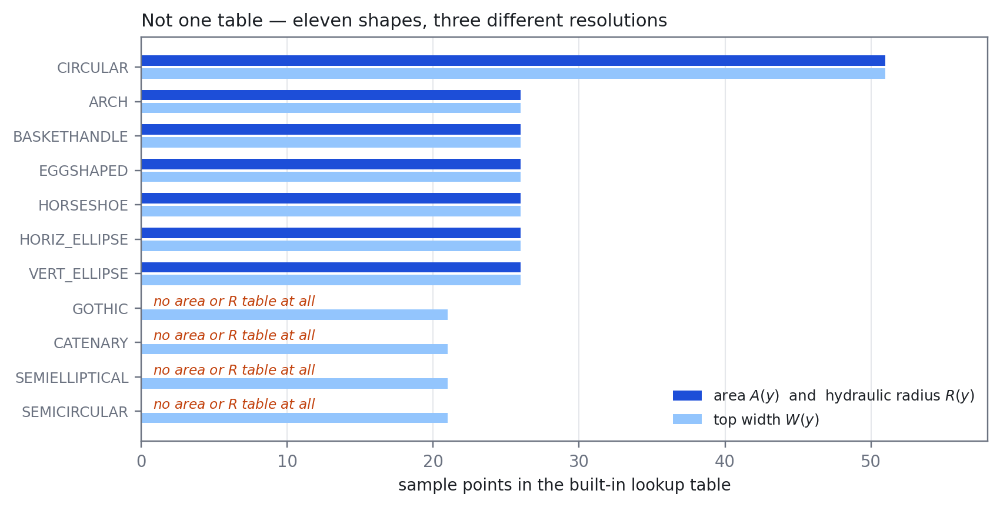
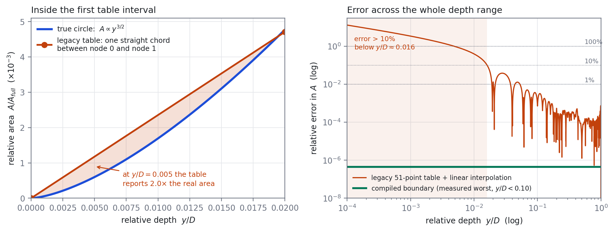

# The Pipe Is Not a Polygon

### Cross-section geometry in SWMM — the shapes you can't model, the ones you can, and how well

*OpenSWMM Engine · Engineering Newsletter · August 2026*
*Corinne Wiesner & Caleb Buahin · HydroCouple/openswmm.engine*

---

## Five problems that are really the same problem

Ask a modeler what they wish SWMM could do, and a surprising number of the
answers turn out to be about the shape of the pipe.

- **"This sewer isn't in the catalogue."** A benched trunk main with shelves
  either side of a dry-weather channel. A hand-laid brick egg whose proportions
  don't match SWMM's egg. A box culvert with filleted corners. An as-built
  profile from a CCTV or laser survey. SWMM does have escape hatches here —
  `CUSTOM` takes a user width-versus-depth curve, and `IRREGULAR` takes a
  surveyed transect — but each comes with conditions. `IRREGULAR` is an *open*
  channel, so it cannot close over the top of a box culvert or a full pipe.
  `CUSTOM` is closed but **symmetric**: a width-versus-depth curve says how wide
  the water is, not where the walls are, so it cannot express a pipe deformed on
  one side, or a bench on one side only — and since wetted perimeter depends on
  where the walls actually are, friction is then computed against an assumed
  shape rather than the real one. Both are resampled into fixed 51-point
  interpolated tables, which reintroduces exactly the error the rest of this
  article is about: the `CUSTOM` table carries about **41% area error below 5%
  of full depth**. And a bench's top-width jump — the whole point of a bench —
  gets smoothed away by the interpolation rather than represented.

- **"The pipe silts up."** Grit accumulates through a dry season and scours out
  in the first real storm. `FILLED_CIRCULAR` covers part of this: a circular
  pipe with sediment to a **fixed** depth. What it does not cover is any other
  shape, or any change over time — the fill depth is set before the run and
  cannot move, so deposition and scour cannot interact with the hydraulics that
  drive them. Today you either ignore that or maintain two separate models.

- **"That reach is deformed."** A flexible pipe squatted by cover load, or a
  haunch flattened where it was laid on a rock. A symmetric ovalisation is
  reasonably served by an elliptical section with custom dimensions. A
  *one-sided* deformation is not served by anything: it is asymmetric, so
  `CUSTOM` cannot describe it, and closed, so `IRREGULAR` cannot either.

- **"We're relining next year."** CIPP shrinks the bore by a wall thickness and
  changes the roughness. Both the before and the after are perfectly ordinary
  circular sections — it is the *transition* that has nowhere to live. Asset
  managers want before, after and the change between them, ideally in one run.

- **"Roots and grease are closing it up."** Progressive narrowing over months.
  Again each individual state is expressible; the trajectory is not.

So we set out to make that layer flexible. And when we looked closely at how
well SWMM represents the shapes it *does* offer, we found something we did not
expect.

---

**A few words used throughout.** The **invert** is the inside bottom of a pipe
and the **crown** the inside top. **Wetted area** $A$ is the cross-section of
water at a given depth; **top width** $W$ is the width of its surface; **wetted
perimeter** $P$ is the length of wall the water touches, which is where
friction acts. **Hydraulic radius** $R = A/P$ is the single number Manning's
equation uses to describe a section's shape, and **section factor** $A R^{2/3}$
is its capacity to carry flow. **Continuity error** is SWMM's own mass-balance
check — how much water the model lost or invented over a run.

**Figure 1 — One pipe, one volume of water, two water levels.** *Left:* a 2 m
gothic trunk sewer, drawn from SWMM's own shipped geometry, holding 2% of its
capacity — an ordinary dry-weather condition. SWMM 5.2.4 carries two
independent descriptions of this shape: a depth-versus-area table (its only
source for wetted area) and a top-width table. Ask each where the water surface
sits for this volume of water and they disagree: **0.090 m** by the area
description, **0.146 m** by the width description. The blue is water both
descriptions agree on; the orange band is the **56 mm** where the surface may
or may not be — a 61% disagreement about the depth of flow. Everything is drawn
at true scale; nothing is zoomed or exaggerated.

*Right:* the same question asked across the whole dry-weather and
early-filling range — water-surface height against stored water, from 0 to a
quarter of the pipe's capacity. The solid curve is the area description, the
dashed curve the width description; the two dots are the left panel's two
surfaces. The curves should be one curve. The band between them is the model's
built-in ambiguity about where the water is, it never closes in this regime,
and it grows without bound toward the invert: at 0.5% of capacity the two
answers are **23 mm versus 74 mm** — a factor of 3.3.

This is not measurement error, and it is not an approximation we introduced.
Both curves are shipped constants in EPA SWMM 5.2.4, and a LEGACY-mode run
consults **both** — area from one description, top width from the other — so
the disagreement between them propagates into surface storage, friction,
conveyance and wave speed on every time step. It has simply never been drawn.
Under the exact-geometry path there is one curve, because there is one object
to read it from.

---

## 1. What we found: the built-in shapes are coarser than they look

For most closed conduits, SWMM does not compute area, width or hydraulic radius
from the pipe's geometry at all. It looks them up in a small digitized table,
sampled uniformly in depth, and draws a straight line between the two nearest
rows.

The first surprise is that there is no single table. There are eleven shapes,
at three different resolutions, and four of them are missing tables entirely.

**Figure 2 — the built-in table inventory.** Every tabulated shape in SWMM,
and how many sample points each of its lookup tables actually carries. Read
directly from `xsect_tables.hpp`. Circular has twice the resolution of anything
else; four shapes have no area or hydraulic-radius table at all and reconstruct
both indirectly from 21 points of top width. The article's error findings track
this chart closely — the sparser the shape, the worse it behaves.

**CIRCULAR** is the best-resourced shape, with 51 points for area, hydraulic
radius and width. **ARCH, BASKETHANDLE, EGGSHAPED, HORSESHOE** and both
**ellipses** carry 26. **GOTHIC, CATENARY, SEMIELLIPTICAL** and
**SEMICIRCULAR** have **no area table and no hydraulic-radius table at all** —
only 21 points of top width, from which the rest is reconstructed indirectly.

None of this was careless. It was a memory budget from the 1970s: 51 doubles is
408 bytes per shape per quantity, and the whole catalogue had to fit in a few
kilobytes. It is simply not a constraint any machine has today.

> Shapes defined by **formula** rather than table — rectangular, trapezoidal,
> triangular, parabolic, power-function, modified basket — carry no
> interpolation error, and nothing in this section applies to them.

### 1.1 The error concentrates where shallow flow lives

Take the best case: a circular pipe, the one shape with a full 51-point table.
Near the invert the wetted area grows like $y^{3/2}$ and the top width like
$y^{1/2}$ — both with **unbounded slope at $y = 0$** — which is exactly where
straight-line interpolation has the least to work with.

**Figure 3 — legacy area error for a circular pipe.** Left: the wedge between
the first table chord and the true curve. Right: the same error across the full
depth range, log–log.

The right-hand panel deserves a careful reading, because the headline number is
easy to misuse. The relative error does not have a worst value: it **diverges**
as depth goes to zero, because a straight chord leaving the origin cannot track
a $y^{3/2}$ curve. The "470%" this project's test suite reports is simply the
value at the shallowest depth that sweep happened to sample.

The sampling-independent statement is a set of crossings, which we verified
directly against the shipped constants:

| Regime | Legacy relative error in area |
|---|---|
| $y/D < 0.005$ | **> 100%** |
| $y/D < 0.016$ | **> 10%** |
| $0.016 < y/D < 0.053$ | falls fast, but rises back above 1% three more times |
| $y/D > 0.053$ | below 1% everywhere |
| $0.3 \le y/D \le 0.7$ | ~$5\times10^{-4}$ |

Note that the middle rows are not a monotone decay. The error is a *sawtooth*
— zero at every table node, largest between them — so it first dips below 1% at
$y/D \approx 0.019$, then rises back above it three more times, last returning
below 1% for good at $y/D \approx 0.053$. The right-hand panel of Figure 3
shows the shape of it directly.

And the honest counterweight: the **absolute** error is always small, peaking
around $7\times10^{-4}$ of the full area (near the crown, at
$y/D \approx 0.99$). In a 1 m pipe, the region where the table is off by more
than 10% is a film less than 16 mm deep.

That matters anyway, for two reasons. Manning's equation carries area to the
**5/3 power**, so a 40% area error is roughly a **75% flow error** before
roughness is consulted — and that is holding the wetted perimeter fixed, which
a real geometry error does not, so treat it as an order-of-magnitude argument
rather than a coefficient. And in the finite-volume solver, area *is* the state
variable — the depth reconstructed from it sets the wave speed and the
timestep, so a shallow error is not a small volume, it is a wrong answer to the
question the solver is asking.

### 1.2 The tables also contradict each other

This is the more fundamental problem. Area, width and hydraulic radius are
stored as **separate, independently digitized tables** — but they are not
independent quantities. For any real cross-section, the top width *is* the
derivative of the area:

$$W(y) = \frac{dA}{dy}.$$

If both tables described the same pipe, differentiating one would reproduce the
other. It does not — and checking this needs **no external reference at all**.
Figure 1 is this contradiction made physical for one shape; the table below
measures it for all of them:

| Shape | width points | area source | at $y/D=0.02$ | median, full range | share of depth off by >10% |
|---|---|---|---|---|---|
| CIRCULAR | 51 | 51-pt area table | −6% | 0.7% | 5% |
| HORSESHOE | 26 | 26-pt area table | +28% | 1.3% | 11% |
| BASKETHANDLE | 26 | 26-pt area table | +47% | 5.6% | 18% |
| EGGSHAPED | 26 | 26-pt area table | **+37%** | **8.1%** | 42% |
| SEMIELLIPTICAL | 21 | inverted depth–area table | +82% | 10.7% | 53% |
| CATENARY | 21 | inverted depth–area table | +97% | 15.0% | 60% |
| **GOTHIC** | 21 | inverted depth–area table | **+202%** | **14.3%** | 65% |
| SEMICIRCULAR | 21 | inverted depth–area table | +72% | **17.7%** | 71% |

*Method, so this is reproducible: resample both descriptions densely, scale each
by the shape's own declared `aFull` and `wMax` from `xsect.c`, differentiate the
area numerically, and compare against the tabulated width. The four shapes with
no area table are handled through the depth–area table the engine actually
inverts to get their area. ARCH and the two ellipses are omitted because their
full-area constants come from manufacturer size-code tables, so their answer
depends on which pipe size you pick.*

A **+202%** disagreement means the width implied by gothic's area description
is three times the width its own width table reports. **Gothic's two
descriptions cannot both be describing the same pipe.** And the pattern is
orderly rather than random: the four shapes at the bottom of the table are
exactly the four with no area table of their own, and they are off by more than
10% across the majority of their depth range.

There is a second, independent contradiction in the same tables. Integrating
each width table gives a full-pipe area that does not match the closed-form
`aFull` the engine uses for that shape — **3.4% low** for the egg, **5.9% low**
for basket-handle, **2.1% low** for gothic. The shapes disagree with themselves
about their own capacity.

Interpolation is not the only source of error, either. The shipped constants
are themselves rounded: `A_Circ` at $y/D = 0.02$ reads 0.00471 where the
analytic circle gives 0.004773 — **1.3% off at a table node**, where
interpolation contributes nothing. Refining the sampling would not remove that.

The same shows up when the two paths are run head to head through the engine's
own accessors rather than reconstructed on paper: over $0.3 \le y/D \le 0.7$ —
clear of both the invert and the crown — **EGGSHAPED** area differs by up to
**4.7%** and hydraulic radius by **3.6%**, with top width the best behaved at
under 0.5% (`test_legacy_shape_boundary.cpp`).

### 1.3 Why calibration doesn't dispose of this

The reasonable objection is that Manning's $n$ absorbs it. It does — and that
is the problem, not the answer. The $n$ that comes out of calibration is:

- **depth-dependent in disguise**, because the geometric error changes with
  depth but a single $n$ cannot;
- **shape-dependent in disguise**, because two reaches with physically
  identical roughness need different $n$ if their tables are wrong by different
  amounts;
- **network-dependent**, because errors compound downstream.

You cannot calibrate away a systematic bias — only relocate it. This is a
plausible contributor to a familiar frustration: calibrated $n$ values that sit
outside textbook ranges and refuse to transfer between models of the same
physical system. *Plausible* is deliberate; see [§5](#5-what-we-have-not-shown).

---

## 2. The fix, in outline

> **Draw the pipe's real boundary, compute its hydraulics exactly from that
> boundary once when the model loads, and compress the exact answer into a
> small polynomial the solver can evaluate as fast as a table lookup.**

Two stages, and the split is the whole idea.

**When the model loads,** the cross-section is a closed chain of straight
segments and circular arcs. Green's theorem [5] turns every area and moment
integral into a boundary integral with a closed-form contribution from each
segment and each arc — so at any depth, the answer is exact to round-off. No
sampling, no interpolation.

**In the time loop,** that exact answer has already been compressed into a
piecewise polynomial. The solver evaluates a short chain of multiplies and
adds: no table, no boundary traversal, and no expensive maths functions at all.

> **Why the compression works.** The area-versus-depth curve is not smooth
> everywhere: it kinks where the water surface crosses a corner, and it picks
> up a square-root branch point where the surface goes tangent to a curved wall
> (the invert and crown of a round pipe). Split the depth range at exactly
> those *critical heights* — the depths where the wetted cross-section changes
> character — and on each piece the curve is analytic, where polynomial
> approximation converges **geometrically** [2]. A handful of coefficients reaches
> a tolerance a uniform table would need thousands of samples for. For the
> mathematically inclined: the critical heights are the critical values of a
> Morse function on the section [3], the piecewise structure is a Reeb graph on
> the depth axis [4], and a per-piece change of variable removes the branch
> points so the Chebyshev series sees an analytic function.

Two properties follow that a table cannot offer. **Width is the exact
derivative of the same series that gives area**, so §1.2's contradiction is not
reduced, it is impossible. And every quantity — area, perimeter, hydraulic
radius, section factor — comes from **one** object, so they cannot drift apart.

### 2.1 What it gives a modeler

**A `POLYGON` cross-section.** Give a conduit an explicit boundary of lines and
arcs, and it is evaluated exactly. That covers benched channels, filleted
boxes, surveyed profiles, non-standard eggs and arches — anything you can draw.

**`[OPTIONS] XSECT_GEOMETRY EXACT`.** The built-in tabulated shapes are
reconstructed as real boundaries and evaluated the same way, instead of through
their lookup tables. It is opt-in and alpha; `LEGACY` is the default and its
output is byte-for-byte unchanged.

**Cross-sections that change during a run.** A conduit's shape can be replaced
between routing steps, and the solver reconciles the water already in the
cells. The caller states which physical event it is, and there is deliberately
**no default**, because the two possibilities are opposites:

| | Physics | What happens to the water |
|---|---|---|
| **Material intrudes** | sediment, a liner | The free surface stays put; the new material displaces water, and that volume leaves the conduit. |
| **Material is removed** | scour, corrosion, cleaning | The same water occupies a larger section, so the free surface drops. |

This is the piece that answers sediment, relining and progressive narrowing.
One subtlety is worth stating because it is counter-intuitive: **a sediment bed
is not simply a smaller pipe.** A flat bed sitting in a round invert is *wider*
at the water line than the curved invert it buried, so a silted conduit can
hold *more* water at a given depth above the bed than the clean pipe held above
its invert. The engine tracks the bed level separately and preserves the free
surface's **elevation** rather than its numeric depth — without that, filling a
pipe with sediment reads as adding capacity.

Mid-run changes currently require the finite-volume solver; the legacy
dynamic-wave and kinematic-wave solvers accept a new section before a run
starts but not during one.

> **The mechanics are not in this article on purpose.** How the boundary is
> validated, how the pieces are chosen, how the series are evaluated, what is
> memoized and what the failure modes are — all of it is in the pull request
> and in `docs/dev/cheb_section.md`. See [§6](#6-where-the-details-are).

---

## 3. What changes, and it depends on your solver

This is the part worth knowing before switching a production model. The two
routing solvers consume geometry differently, and that difference — not the
size of the geometry error — decides whether `EXACT` moves your answer.

- **DYNWAVE *consults* geometry.** It asks for an area at a depth and uses the
  answer in that timestep. An error perturbs that step and is not carried
  forward.
- **FV *embeds* geometry in its conservation statement.** The cell state is
  flow **area**, and depth is recovered by inverting the same geometry every
  cell, every substep. Errors there propagate into mass.

Measured on **Bellinge** — a real Danish urban drainage model, 1015 conduits,
dry-weather flow:

| Continuity error | LEGACY | EXACT | |
|---|---|---|---|
| **DYNWAVE** | −0.073% | +0.087% | comparable — no meaningful difference |
| **FV**, 2 h window | **−2.253%** | **−0.134%** | **~17× better** |
| **FV**, filling window | −4.453% | −0.022% | ~200× better |

The FV rows are the result. On the filling window — the dry-to-wet transient,
precisely where the tables are worst — geometry representation alone moves mass
conservation by two orders of magnitude.

Two honest notes. The DYNWAVE row shows `EXACT` marginally *larger* in
magnitude than `LEGACY`; both are small, and the reading is "no meaningful
difference," not "EXACT wins." And the filling-window row predates later fixes
to the FV closure and has not been re-measured on the current head; the 2 h row
is current.

### 3.1 What it costs

Measured on a 2020 MacBook Pro (Intel i5-1038NG7, 4 cores). **Ratios are the
portable figure, not the seconds.**

| Solver | LEGACY | EXACT | ratio |
|---|---|---|---|
| DYNWAVE, Bellinge 48 h | 40.0 s | 63.1 s | ~1.58× |
| FV, Bellinge 2 h | 319.9 s | 536.2 s | ~1.68× |

Per-shape kernel cost varies a great deal, and not always against the new path:
**gothic is 5.6× faster** compiled than tabulated, because its legacy path has
no area table and has to reconstruct one. Circular — the shape most networks are
mostly made of, and the only one with a full 51-point table — is the worst case
at about **1.15× slower** per call, and the compiled path is computing a fourth
quantity for that price. Across the whole model the end-to-end penalty stays
under about 1.7×.

Bellinge is a case study in why the shape mix matters more than any single
per-shape number. Of its 1031 cross-sections, 953 are CIRCULAR and the
remaining 78 (CUSTOM, RECT_OPEN, RECT_CLOSED) are shapes `EXACT` does not
compile at all — CUSTOM is a per-instance table rather than a built-in shape,
and the rectangular ones are already closed-form with nothing to gain. So on
this network the entire measured `EXACT` cost above, and the entire measured
accuracy gain in §3, are the *same* 953 pipes. We confirmed this directly:
restricting `EXACT` to every shape except circular produces a `.out` file
that is byte-for-byte identical to `LEGACY`, because there is nothing left
for it to compile. Bellinge cannot tell you whether exact geometry pays for
itself on the shapes it helps most — it does not contain any of them.

Most of that gap is not the geometry — it is the price of a reproducibility
guarantee. To promise that `LEGACY` reproduces EPA SWMM bit for bit, the engine
compiles with one processor optimization switched off: the one that folds a
multiply and an add into a single instruction. Ordinary code barely notices,
but polynomial evaluation is almost *nothing but* alternating multiplies and
adds, so it is exactly the code that loses most. A table lookup barely uses it.
The guarantee costs `LEGACY` about 10% and `EXACT` about 54%.

> **For build engineers.** The setting is the compiler's `-ffp-contract` flag,
> currently forced `off` across all targets. Letting it fuse again is
> reasonable when you are running FV — which sits outside the bit-parity
> contract by design — or when every comparison you care about is between runs
> of the *same* binary: sensitivity sweeps, calibration trials, profiling. It
> is not reasonable for anything checked against EPA SWMM 5.2.4, anything that
> must reproduce a committed golden hash, or any regulatory deliverable.

---

## 4. When to use it

**Reach for `EXACT` when** you are running **FV**, where the mass-conservation
gain is one to two orders of magnitude; when your model spends real time at
**shallow depth** — dry-weather flow, long inter-event periods, the filling
limb; or when your network uses **GOTHIC, CATENARY, SEMIELLIPTICAL or
SEMICIRCULAR**, which have no built-in area table and are both more accurate
*and* faster compiled.

**Reach for `POLYGON`** whenever the section you need isn't in the catalogue,
or needs to change during the run.

**Stay on `LEGACY` when** you need bit-reproducibility with EPA SWMM 5.2.4 —
regulatory submissions, consent-decree modeling, anything where reproducing a
historical result *is* the deliverable. Also when your conduits are
rectangular, trapezoidal, triangular or parabolic, whose formulas are already
exact, and when you are running DYNWAVE and content with your current
continuity.

### 4.1 A third mode, not yet built: optimizing for speed instead of accuracy

`LEGACY` and `EXACT` are presented as one global switch, but the dispatch
underneath is already per link — every conduit's compiled-boundary pointer is
decided independently at load time (§2.1). "Compile everything `EXACT` can"
and "compile nothing" are just the two extreme settings of a policy that
already exists per shape. The measurements above suggest a third setting
between them is worth naming — something like `XSECT_GEOMETRY SPEED` — that
compiles a shape's boundary exactly when doing so is *faster*, whether or not
it is more accurate.

For gothic, catenary, semi-elliptical and semicircular that would be the same
decision `EXACT` already makes: a pointed or open crown is analytic and needs
no coordinate map, so compiled is both faster and more accurate there, and
there is no trade to weigh. Circular is the one shape where `SPEED` would
diverge from `EXACT`: its round crown genuinely needs a square-root map, which
is the ~15% cost measured in §3.1 for a fourth field a speed-only policy
would not want. `SPEED` would leave circular on the legacy table and accept
its already-quantified shallow-depth error (§1.1) in exchange for the table's
speed.

That divergence is the honest part of naming the mode: `SPEED` optimizes for
wall-clock, not correctness, and on circular those point in different
directions. Everywhere else in the twelve-shape catalogue the two goals
appear to agree — but "appear to" is doing real work here. Only circular and
gothic have a *measured* per-shape runtime; the other ten are inferred from
the same structural argument (round crown costs, pointed crown is free), not
timed. Building `SPEED` for real means measuring all twelve before trusting
the policy, not just the two we already have numbers for.

The Bellinge finding above previews exactly what `SPEED` would do on a
circular-dominated network: nothing. A 92%-circular catchment would run at
`LEGACY`'s speed under `SPEED`, for the same reason restricting `EXACT` to
non-circular shapes did — there is no non-circular traffic to redirect.
`SPEED` earns its name on networks that actually contain the shapes it
helps — egg, gothic, arch, basket-handle sewers — where it would deliver
`EXACT`'s speed gains without asking a modeler to accept `EXACT`'s (small)
circular-pipe slowdown to get them.

---

## 5. What we have not shown

Worth stating plainly, because a result like this is only useful with its
boundaries attached.

**No validation against measurement.** Every figure here is measured against
exact geometry, against the tables' own internal contradictions, or against the
model's own mass balance. Nothing is measured against observed flow or level.
Until that run happens, the correct claim is *"the geometry is demonstrably
more correct,"* not *"the model is more accurate."*

**The calibration argument in §1.3 is a hypothesis.** It follows from
$Q \propto A^{5/3}$ and matches practitioner experience, but no before-and-after
calibration study has been done. If `EXACT`-calibrated $n$ values move toward
textbook ranges, that is the cleanest confirmation available; if they do not,
the argument weakens considerably.

**"Exact" is qualified for most shapes.** Circular and `POLYGON` sections are
genuinely exact. The other tabulated shapes are reconstructed from *their own*
21-to-26-point width tables — so `EXACT` gives them internal consistency and
smooth interpolation, but cannot add information the width table never had. For
gothic, whose two descriptions disagree by 202% near the invert, it resolves
the conflict by believing the width table; gothic results will move noticeably.

**One network, one machine.** Bellinge is a single catchment, mostly circular,
under dry weather. Run-to-run variation on this machine reaches 18%, so treat
single timings sceptically.

**The FV continuity attribution is correlational.** The direction and magnitude
fit the shallow-table explanation and no rival has been offered, but it has not
been isolated by a controlled experiment.

---

## 6. Where the details are

Everything deliberately left out above — the boundary primitives and their
validation, the critical-height enumeration, the coordinate changes, the
compiler and its tolerances, the dispatch through both solvers, the C API for
run-time geometry change, and the defects found and fixed along the way — is in
the **`feature/xsect-geometry` → `swmm6_rel` pull request** (39 commits) and in
two design pages that ship with the engine:

- `docs/dev/cheb_section.md` — the exactness argument, the convergence
  argument, and the measured performance.
- `docs/dev/legacy_defects.md` — a register of defects inherited from EPA SWMM
  5.2.4 that the bit-parity contract deliberately preserves, so they stop being
  folklore.

User-facing documentation for `POLYGON` and `XSECT_GEOMETRY` is in the manual's
`[XSECTIONS]` and `[CURVES]` reference.

---

## 7. The takeaway

We began wanting SWMM to represent pipes that silt up, sag, get relined, or
were never in the catalogue to begin with. Getting there meant replacing the
geometry layer — and replacing it turned up a second finding we were not
looking for: **the tables the catalogue shapes rely on contradict themselves**,
in one case by more than the quantity they describe.

Both results are checkable without taking anyone's word for it. Gothic's width
table and its area description disagree by 202% at 2% depth, and by more than
10% across two-thirds of the pipe's depth, with no external reference needed.
And in the finite-volume solver, geometry representation alone moves mass
conservation by an order of magnitude or more on a real 1015-conduit network.

What remains unproven is the thing a practising modeler cares about most:
whether a model built on exact geometry *predicts* better than one built on
tables plus a calibrated roughness. Exact geometry removes a known bias — but a
bias absorbed into every calibration for fifty years will not surrender
quietly, and settling it means calibrating an instrumented catchment both ways.
That is the next piece of work, and we would rather say so than imply the case
is closed.

---

## References

1. **Rossman, L. A.** (2017). *Storm Water Management Model Reference Manual,
   Volume II — Hydraulics.* EPA/600/R-17/111. The reference for the
   table-based geometry approach and the Manning relationships it serves.
2. **Trefethen, L. N.** (2013). *Approximation Theory and Approximation
   Practice.* SIAM, Chs. 3 and 8. Chebyshev series, and the geometric
   convergence of polynomial approximation to analytic functions — the theorem
   the compression rests on.
3. **Milnor, J.** (1963). *Morse Theory.* Princeton University Press. Between
   consecutive critical values a sublevel set varies smoothly, which is the
   condition that convergence needs.
4. **Edelsbrunner, H. & Harer, J.** (2010). *Computational Topology: An
   Introduction.* AMS, Ch. VI. Reeb graphs — the formal object the piecewise
   structure implements.
5. **Apostol, T. M.** (1969). *Calculus, Vol. II*, 2nd ed. Wiley, Ch. 11.
   Green's theorem on a piecewise-smooth boundary, in the form used here.

---

*OpenSWMM Engine, `swmm6_rel` line (v6.0.0-alpha). The legacy solver in
`src/legacy/` is unmodified, and `LEGACY` output is byte-for-byte identical to
the pre-change build. Figures were generated directly from the shipped table
constants and the analytic circular-segment formula, independently of the
engine build.*
