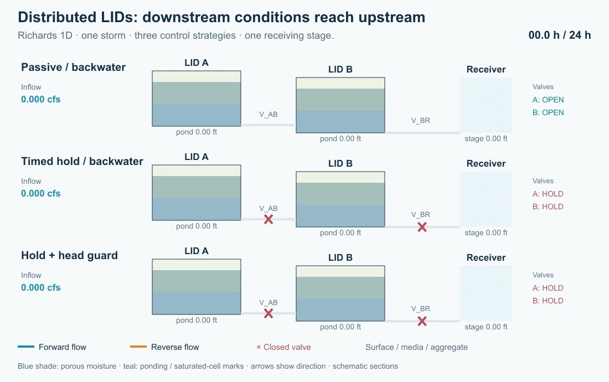

# Hydraulic Controls and Distributed LID in Open-Source SWMM 6

### From individual practices to distributed systems: detention, treatment, active control and receiving waters

Caleb Buahin
October 4, 2026

A rain garden can perform well on its own and still be part of a drainage system that performs poorly. Its outlet may meet a high downstream water level. Several facilities may release together. Holding water for treatment may leave too little capacity for the next storm. And water that infiltrates does not necessarily disappear from the watershed.

These questions have motivated the new LID Storage node implementation in Open-Source SWMM 6 (SWMM2D). The aim is to move beyond evaluating performance of localized low impact development practices and examine the system-wide implications of distributed LIDs for receiving groundwater and water bodies: flow peaks, timing, cumulative pollutant loads and the pathways connecting facilities.

*Figure 1. A simulated storm moves through two layered storage nodes. Blue arrows show forward flow; amber arrows show reversal; crosses mark closed valves. The receiving-water stage rises between hours 3 and 4, stays high until hour 7, then falls. Dots indicate direction, not tracked particles. Cross-sections are schematic and use a common head datum. [Static figure](../../img/articles/lid-storage-node/network-static.png).*

## Why the network matters

Conventional SWMM LIDs remain useful for describing rainfall, infiltration and drainage within a subcatchment. SWMM can also represent treatment trains by routing runoff between dedicated subcatchments; LIDs within one subcatchment are treated in parallel. The new development addresses a different modeling need: make the layered facility an explicit part of the hydraulic network, with connected ports, downstream heads and controllable outlets. See the [EPA SWMM 5.2 User's Manual](https://nepis.epa.gov/Exe/ZyPURL.cgi?Dockey=P10145M6.TXT).

That makes it possible to explore questions such as:

- Does detention at an upstream facility reduce a downstream peak, or move it into the peak from another tributary?
- How does downstream backwater change available storage, flow direction and exposure to treatment media?
- Can a controller retain polluted runoff while preserving capacity for a second storm?
- How much pollutant is transformed, discharged, bypassed or still stored at the end of the assessment?

Research on water-quality-informed real-time control provides a motivation for asking these questions. Sharior, McDonald and Parolari studied detention-basin control using water-quality information, with outcomes dependent on rainfall conditions. Gomes Junior and colleagues examined valve-control strategies and detention/flood tradeoffs in a stormwater network. Those studies support investigating controls; they do not establish the performance of the hypothetical LID train below. [Sharior et al., 2019](https://doi.org/10.1016/j.jhydrol.2019.03.012); [Gomes Junior et al., 2022, preprint](https://arxiv.org/abs/2205.01017).

## A layered facility that remains a storage node

The implementation attaches a LID control to an ordinary storage node. Storage geometry supplies its footprint. An ordered stack supplies the surface, media and aggregate thicknesses and moisture properties. Ordinary hydraulic links supply connections to other facilities and the receiving water.

A facility can therefore have a low-level drain, an elevated overflow and a controlled connection to a second facility. Dynamic Wave routing represents the effect of downstream head and flow reversal. Layer-relative outlet anchors follow physical stack edits; a link joining two LID nodes uses explicit endpoint offsets.

The distinction matters for water quality. Retained pore water carries pollutant mass, while hydraulically connected saturated water uses a shared storage reactor. Layer treatment can specify fixed removal, first-order decay and optional expressions. A surface bypass does not automatically receive all the treatment rules beneath it. The stack is **not a sequence of independent saturated plug-flow reactors**.

In the present implementation, storage-node pollutant routing uses Dynamic Wave with the Legacy quality solver. Assigning a LID does not add rainfall automatically: supply runoff through contributing subcatchments or an external inflow. Native INP and GeoPackage preserve the extension; export to legacy SWMM 5 does not preserve this behavior.

## Six small experiments with one common system

The accompanying tutorial uses two 1,000 ft² facilities, **A** and **B**, connected in series. Each has a six-inch surface layer, twelve inches of media and twelve inches of aggregate. Valve **V_AB** connects A to B; **V_BR** connects B to receiving boundary R. Separate emergency weirs connect each surface to an outfall, so bypasses remain visible in the assessment.

A two-hour triangular inflow peaks at 0.30 cfs and delivers 1,080 ft³ to A. It contains 20 mg/L of a conservative tracer and 20 mg/L of a hypothetical reactive constituent. The reactive constituent has a first-order rate of 2/day in each porous layer, with no fixed percentage removal. This deliberately simple assumption isolates the effect of exposure time. It is not a calibrated prediction for sediment, nitrogen or phosphorus.

For the backwater cases, R rises to a head of 1.60 ft. Reverse water is explicitly assigned zero pollutant concentration, making it a clean hydraulic boundary rather than an unreported pollutant source. Separate engine regression cases test both clean and held-concentration backflow.

| Experiment | Change from the common setup | Question |
|---|---|---|
| 01 Passive / free outlet | Open valves; low receiving stage | What is the baseline detention and export? |
| 02 Passive / backwater | Open valves; rising receiving stage | How much does the boundary change the whole train? |
| 03 Timed hold | Open A at 6 h; B at 8 h | Can a planned hold delay export and increase calculated treatment? |
| 04 Hold + head guard | Add downstream-head isolation and a reopening band | Can control limit reverse flow without trapping the system indefinitely? |
| 05 Second storm | Add a 0.45 cfs pulse peaking at 10 h | What happens when the first event has occupied storage? |
| 06 Stuck closed | Both valves remain closed during both storms | Where do the water and pollutant go when control fails? |

The head guard closes a valve when its downstream head exceeds 1.25 ft and keeps it closed until that head falls below 1.05 ft. The reopening band helps avoid rapid switching. A higher-priority depth-relief rule opens a valve above 2.20 ft **only when downstream head is low**. The emergency weirs remain available throughout. These are transparent test rules, not an optimized controller.

*Figure 2. Receiving-outlet flow for the first-storm cases. Negative discharge represents backflow. The plot uses an outlet scale; the inlet peaks at 0.30 cfs. Emergency bypass is evaluated separately.*

## Longer detention can help treatment—and change the risk

<!-- START RESULTS_TABLE -->
| First-storm strategy | V_BR peak (cfs) | Tracer 50% export (h) | Reacted by 24 h |
|---|---|---|---|
| Passive / free outlet | 0.0419 | 7.93 | 46.5% |
| Passive / backwater | 0.0407 | 12.56 | 59.9% |
| Timed hold | 0.0425 | 13.25 | 58.0% |
| Hold + head guard | 0.0414 | 13.37 | 58.1% |
<!-- END RESULTS_TABLE -->

The tracer timing is the elapsed time when sampled discharge through **all three outfalls** has exported half of the event's input tracer mass. It is not a mean residence time or a residence-time distribution. Reported reaction percentages use the engine's cumulative mass budget at 24 hours.

The held strategies delay export relative to the free-outlet baseline and increase the calculated reaction of the hypothetical constituent. But the passive backwater case also holds water longer and can produce more reaction than the controller. That does not make uncontrolled backwater a desirable design: it admits reverse water and changes hydraulic capacity. Treatment, release peaks and safe storage must be assessed together.

The timed release can also produce a receiving-outlet peak above the passive baseline. Active control requires a system objective—perhaps pollutant export under a downstream flow limit—not simply “keep the valve closed longer.”

*Figure 3. Curves progressively reveal cumulative tracer export from sampled link flows and concentrations. The adjacent bars always show the final 24-hour reactive-mass budget; they are not time-varying inventories. All exits and any flooding loss are included. A low export at an intermediate time can mean temporary storage. [Static figure](../../img/articles/lid-storage-node/pollutant-fate-static.png).*

The repeated-storm and stuck-valve cases make that distinction concrete. A zero controlled-outlet flow does not mean zero discharge to the environment. Emergency overflow and flooding can carry pollutant out, while an inventory remains in the facilities. Count every destination before reporting cumulative treatment. In the two-storm guarded case, the engine records approximately 680 ft³ of emergency-weir discharge and 90 ft³ of flooding. With both valves stuck closed, those volumes rise to approximately 1,344 ft³ and 213 ft³. These cumulative totals include brief overflows that coarse snapshots can miss.

## A pollutant balance before a performance claim

For each constituent, the assessment checks:

> Initial mass + incoming mass = discharged mass + flooding and seepage losses + reacted mass + final stored mass.

Storage includes retained pore water as well as mobile water. In a reversing system, incoming mass includes any pollutant carried from the receiving boundary. Concentration alone is insufficient: exported load depends on integrating flow multiplied by concentration over time. The [EPA Water Quality Reference Manual](https://nepis.epa.gov/Exe/ZyPURL.cgi?Dockey=P100P2NY.txt) describes SWMM's pollutant routing and treatment framework.

Developing these tests exposed two accounting problems: returning boundary pollutant was not booked as an external source, and a nearly dry LID could lose the load of water that percolated and drained during the same routing step. The correction carries the same accepted transfer concentration to the donating and receiving compartments, resolves the connected mobile mixtures consistently and books treatment once. Overflow ports also use their physical weir crest when selecting the supplying layer.

<!-- START VALIDATION -->
The six decks were run at fixed routing steps of 0.5, 0.25 and 0.1 seconds. All 18 runs passed the 0.5% water/quality continuity criterion with no engine warnings; reported pollutant errors were below 0.001%. The first-storm receiving-outlet peaks and tracer timings were consistent across those runs. For the second storm and valve failure, we use the engine’s cumulative budgets: 30-second snapshots can alias rapid overflow, so their summed overflow volumes and half-export times are not used as performance metrics. The engine regression checks also passed 138 tests, including eight full-chain mass-conservation variants.
<!-- END VALIDATION -->

A small water-balance error alone is not sufficient evidence of correct pollutant routing. We check a conservative tracer, the reacting constituent and routing-step sensitivity before interpreting treatment. The supplied kinetics, footprints, conductivities, storm pulses and boundary stages remain illustrative. Field applications require site data and pollutant-process calibration.

## Configure the same example in SWMMVis

Open **04_head_guard.inp** from the example bundle, then inspect storage A or B in the Object Browser. Its **LID Control** is **Train** and **LID Initial Saturation (%)** is **10**.

Open the LID Controls editor from **Model → LID Control** and select Train. **Media / aggregate layers** reads **2**. **Ordered layers** contains SURFACE, MEDIA and AGGREGATE, plus the optional BOTTOM boundary. Under **Physical properties**, verify the thicknesses, porosities and conductivity values supplied in the deck; this CFS project displays inches and inches/hour. Under **Pollutant treatment**, select each porous layer, choose REACTIVE, set **Removal (%)** to **0** and **Decay (1/day)** to **2**, and leave **Expression** empty. Use **Apply layers and treatment**, then save the project.

Inspect V_BR's layer-3 bottom anchor and the surface-overflow anchors. V_AB joins two LID nodes and uses explicit offsets. Open **Model → Data Objects → Control Rules…** to inspect the timed, head-isolation and depth-relief rules. Run the six files separately and compare depths, valve settings, signed link flows, concentrations and both continuity reports. The full [T10 tutorial](tutorial.html) supplies parameter tables, rules and interpretation steps; [download all six models](models/lid_active_chain.zip).

## From distributed LIDs to receiving waters—and groundwater

The larger objective is to move from discrete LID performance to the system-wide implications of distributed LIDs for receiving water bodies: event peaks, delayed releases, cumulative loads and the pathways connecting facilities across a watershed.

The new **spatially explicit groundwater model** extends that perspective below the surface. Its mesh-based two-zone representation supports spatial aquifer properties, lateral groundwater flow, recharge, saturation-excess return to the surface and configurable exchange with drainage infrastructure. It provides a basis for asking where infiltrated water travels and when it returns to the drainage network or receiving waters. The demonstrations in this article use a closed bottom boundary; they do not demonstrate a coupled LID–aquifer application or groundwater pollutant treatment.

Future articles will explore that connection: distributed recharge and changing water tables, surface-water–groundwater feedbacks, and how those pathways alter the combined benefits and constraints of LID placement and active control. **The question is becoming what the distributed system delivers to the receiving water, over time.**

## Acknowledgment of AI assistance

OpenAI Codex assisted with drafting and editing this article and developing the scripts used to create its figures and GIF animations. The numerical results come from the documented SWMM simulations. Caleb Buahin is responsible for the technical interpretation and final content.

## References

- U.S. EPA (2022). *Storm Water Management Model User's Manual, Version 5.2*. EPA/600/R-22/030. [EPA manual](https://nepis.epa.gov/Exe/ZyPURL.cgi?Dockey=P10145M6.TXT).
- Rossman, L. A., and Huber, W. C. (2016). *Storm Water Management Model Reference Manual, Volume III: Water Quality*. EPA/600/R-16/093. [EPA reference](https://nepis.epa.gov/Exe/ZyPURL.cgi?Dockey=P100P2NY.txt).
- Sharior, S., McDonald, W., and Parolari, A. J. (2019). Improved reliability of stormwater detention basin performance through water quality data-informed real-time control. *Journal of Hydrology*, 573, 422–431. [doi:10.1016/j.jhydrol.2019.03.012](https://doi.org/10.1016/j.jhydrol.2019.03.012).
- Gomes Junior, M. N., Giacomoni, M. H., Taha, A. F., and Mendiondo, E. M. (2022). *Flood Risk Mitigation and Valve Control in Stormwater Systems: State-Space Modeling, Control Algorithms, and Case Studies*. Preprint. [arXiv:2205.01017](https://arxiv.org/abs/2205.01017).
